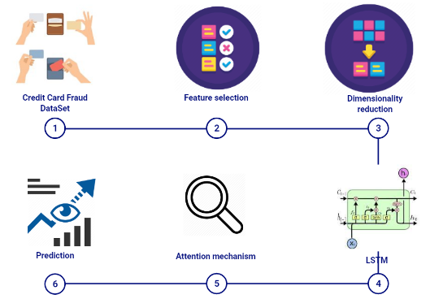
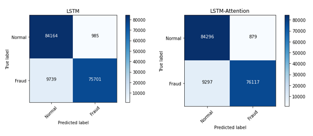

# Enhanced Credit Card Fraud Detection based on Attention mechanism and LSTM deep Model 
As credit card becomes the most popular payment mode particularly in the online sector, the fraudulent activities using credit card payment technologies are rapidly increasing as a result. For this end, it is obligatory for financial institutions to continuously improve their fraud detection systems to reduce huge losses. The purpose of this paper is to develop a novel system for credit card fraud detection based on sequential modeling of data, using Attention mechanism and LSTM deep recurrent neural networks. The proposed model, compared to previous studies, considers the sequential nature of transactional data and allows the classifier to identify the most important transactions in the input sequence that predict at higher accuracy fraudulent transactions. Precisely, the robustness of our model is built by combining the strength of three sub-methods; the uniform manifold approximation and projection (UMAP) for selecting the most useful predictive features, the Long Short Term Memory (LSTM) networks for incorporating transaction sequences and the attention mechanism to enhance LSTM performances. The experimentations of our model give strong results in terms of efficiency and effectiveness.

### Data
Please find Kaggle-Credit Card Fraud Dataset saved in the ```csv``` format and used in our experiments in the ```data/``` directory.

### Architecture

The architecture of the model is illustrated by the following



To highlight the classification performance of our proposed model, in terms of sensitivity, we present a visualization of the confusion matrix of LSTM and our proposed model (LSTM-Attention)


